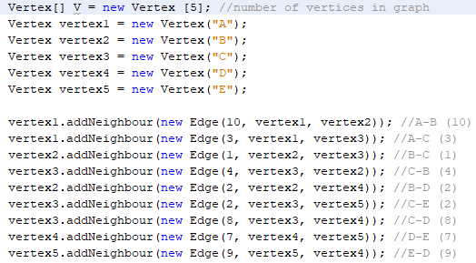
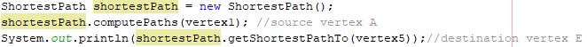
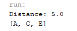

# Dijsktra Algorithm Implementation

*Java code for finding shortest path from a source vertex to destination vertex in a graph data structure via Dijsktra Algorithm using adjacency list implementation*

## Implementation Problem

##  Input the graph

##  Initialize the algo

##  Output

